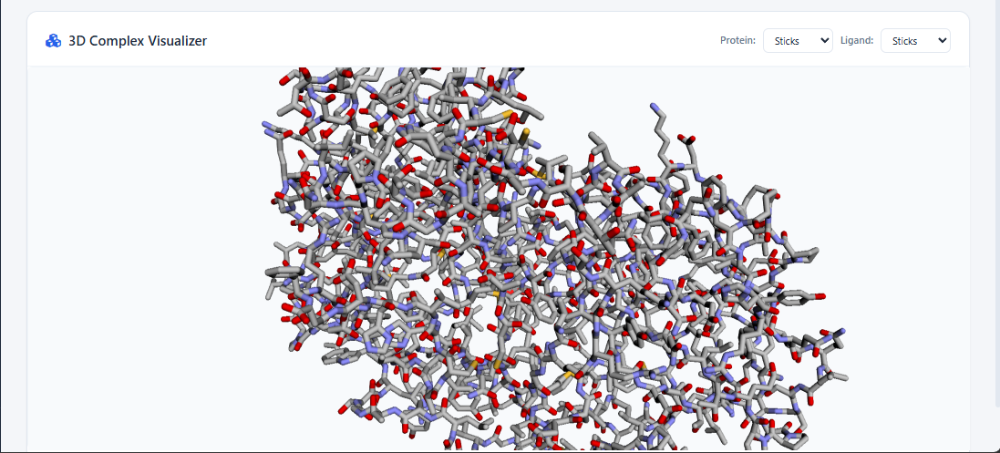
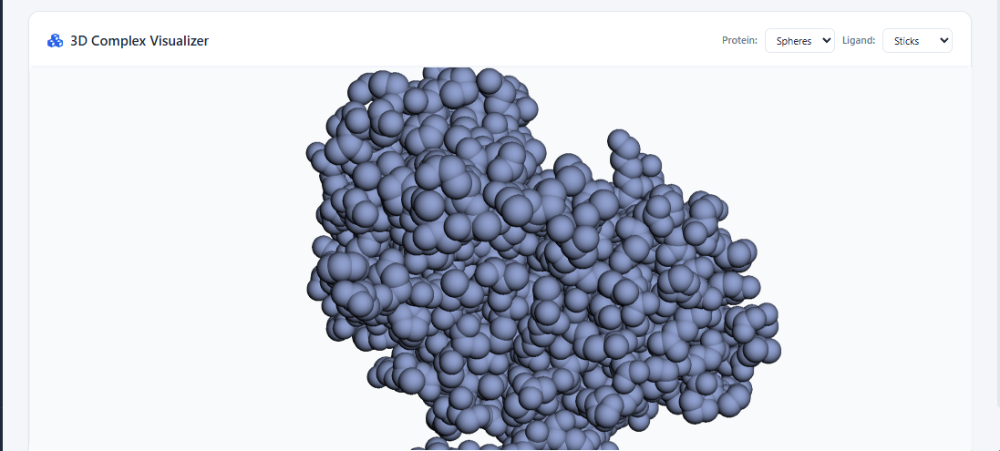
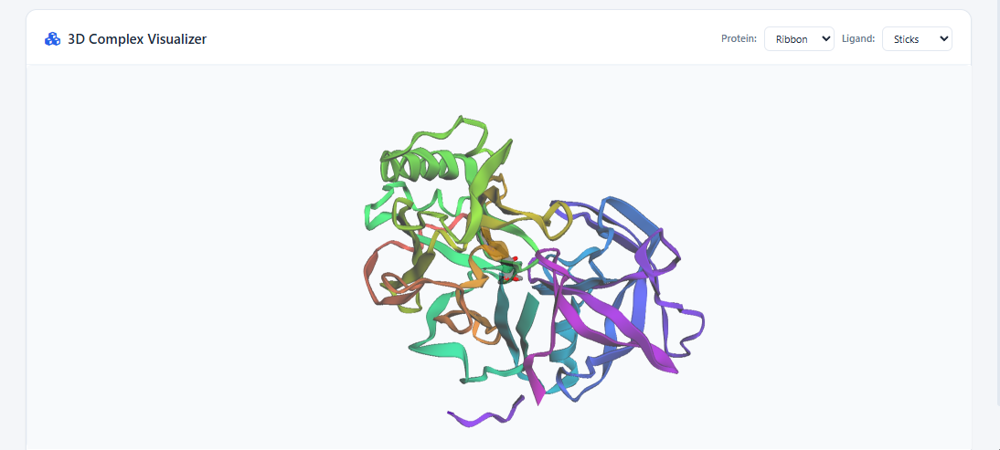

<div align="center">
  <br>
  
  <br>
  <h1>Genome Sentinel</h1>
  <p><strong>Molecular Docking Suite — AutoDock Vina + Interactive 3D Web Dashboard</strong></p>
  <p>
    
    
    
    
  </p>
  <br>
</div>

Genome Sentinel is a self-contained, offline-capable molecular docking workspace. It combines an automated Python pipeline for protein and ligand preparation with a modern web dashboard featuring real-time 3D visualization via 3Dmol.js.

**No cloud dependencies. No subscriptions. Runs entirely on your laptop.**

---

## Features

- **Curated Target Presets** — Alzheimer's (BACE1 / 2B8L), Malaria (PfDHFR / 1LD3), Diabetes (DPP-4 / 2OQV), Breast Cancer (HER2 / 3PP0) with pre-configured binding site coordinates
- **Built-in Ligand Library** — 7 FDA-approved drugs (Donepezil, Chloroquine, Metformin, Lapatinib, Aspirin, Acetaminophen, Ibuprofen) with automatic PubChem 3D structure fetching
- **Custom PDB & SMILES Support** — Download any RCSB PDB target by ID; input any custom SMILES ligand
- **AutoDock Vina Integration** — Automated execution of rigid-receptor molecular docking with full log parsing and binding affinity extraction
- **AI Molecule Generation** — Generate novel drug-like molecules via NVIDIA GenMol NIM integration (requires free NVIDIA API key)
- **Interactive 3D Viewer** — 3Dmol.js-based protein cartoon + docked ligand sticks with style controls (cartoon, sphere, stick, line)
- **Built-in Manuscript Generator** — Auto-compiles results into a markdown academic paper draft
- **No RDKit/Meeko Required** — Uses PubChem API + direct PDBQT conversion as fallback (RDKit C++ DLLs commonly blocked on Windows)

## Screenshots

<div align="center">
  <table>
    <tr>
      <td></td>
    </tr>
    <tr>
      <td align="center"><em>Dashboard &amp; Environment Status</em></td>
    </tr>
    <tr>
      <td></td>
    </tr>
    <tr>
      <td align="center"><em>Docking Grid Configuration</em></td>
    </tr>
    <tr>
      <td></td>
    </tr>
    <tr>
      <td align="center"><em>3D Complex Visualization</em></td>
    </tr>
  </table>
</div>

## Project Structure

```
Genome Sentinel/
├── bin/                          # AutoDock Vina executable
├── data/                         # Working data
│   ├── proteins/                 # Downloaded & prepared target structures (.pdb, .pdbqt)
│   ├── ligands/                  # Prepared ligand libraries (.pdbqt)
│   └── results/                  # Docking output poses + logs + summary.json
├── pipeline/                     # Core Python pipeline
│   ├── setup_env.py              # Download Vina + install Python packages
│   ├── prep_protein.py           # RDKit-based protein preparation (original)
│   ├── prep_protein_no_rdkit.py  # Protein preparation without RDKit (fallback)
│   ├── prep_ligands.py           # RDKit/Meeko-based ligand preparation (original)
│   ├── prep_ligands_no_rdkit.py  # Ligand preparation via PubChem API (fallback)
│   └── run_docking.py            # AutoDock Vina execution + log parser
├── app/                          # Web dashboard
│   ├── index.html                # Single-page application
│   ├── style.css                 # Clean professional UI theme
│   ├── app.js                    # SPA logic, API client, 3Dmol.js integration
│   └── 3Dmol-min.js              # Local copy of 3Dmol.js (no CDN needed)
├── server.py                     # Zero-dependency HTTP server + REST API
├── run.bat                       # Double-click launcher (Windows)
├── implementation_plan.md        # Original design document
└── README.md                     # This file
```

## Quick Start

### Prerequisites

- **Windows 10/11** (the pipeline uses `vina.exe` for Windows; Linux/macOS would need a different Vina binary)
- **Python 3.12+** with `pip`

### Setup

```bash
# 1. Clone or download this repository
cd Genome-Sentinel

# 2. Install Python dependencies
pip install requests

# 3. (Recommended) Install RDKit and Meeko for the primary pipeline
pip install rdkit meeko
```

### Run

**Option A — Double-click `run.bat`**

**Option B — From PowerShell / Terminal**

```bash
python server.py
```

Then open **http://localhost:8000** in your browser.

The server will automatically download AutoDock Vina v1.2.5 on first launch when you click **Initialize Environment** in the dashboard.

### First Smoke Test

1. Open the dashboard at `http://localhost:8000`
2. Click **Control Center** → **Check Status** to verify Vina and Python are ready
3. Go to **Step 1** → Select **BACE1 (2B8L)** preset → Click **Download**
4. Go to **Step 2** → Click **Prepare Preset Library** (fetches 7 drugs from PubChem)
5. Go to **Step 3** → Grid coordinates auto-fill for the selected preset
6. Go to **Step 4** → Select protein + ligand → **Run Screen**
7. Go to **Step 5** → View binding scores → Click **View 3D** to visualize

## REST API Endpoints

| Method | Endpoint | Description |
|--------|----------|-------------|
| `GET` | `/api/status` | Environment status (Vina, RDKit, Meeko, pipeline readiness, GenMol) |
| `POST` | `/api/genmol/generate` | Generate molecules via NVIDIA GenMol NIM (requires `api_key`) |
| `POST` | `/api/setup` | Download Vina binary + install pip packages |
| `POST` | `/api/download_protein` | Download PDB by ID, clean, convert to PDBQT |
| `POST` | `/api/prep_presets` | Prepare all 7 built-in ligand presets |
| `POST` | `/api/prep_custom_ligand` | Prepare a custom ligand from name + SMILES |
| `POST` | `/api/run_docking` | Execute AutoDock Vina with specified grid parameters |
| `GET` | `/api/results` | Get all docking results summary |
| `GET` | `/api/log?file=...` | Get raw log file content |
| `POST` | `/api/delete_protein` | Delete prepared protein files |
| `POST` | `/api/delete_ligand` | Delete prepared ligand files |
| `POST` | `/api/clear_results` | Clear all docking results |
| `POST` | `/api/download_manuscript` | Save manuscript markdown to data/ |
| `POST` | `/api/genmol/generate` | Generate molecules via NVIDIA GenMol NIM |
| `GET` | `/data/...` | Static file serving (proteins, ligands, results) |

## Target Presets

| PDB ID | Protein | Disease | Grid Center (x, y, z) | Box Size |
|--------|---------|---------|----------------------|----------|
| 2B8L | BACE1 | Alzheimer's | (16.0, 10.0, 15.0) | 22 Å |
| 1LD3 | PfDHFR | Malaria | (32.5, 14.8, -3.2) | 22 Å |
| 2OQV | DPP-4 | Diabetes | (40.1, 38.5, 50.3) | 22 Å |
| 3PP0 | HER2 | Breast Cancer | (14.8, 17.5, 94.6) | 22 Å |

## Ligand Presets

| Ligand | SMILES | Target Context |
|--------|--------|----------------|
| Donepezil | `COC1=...CC4=CC=CC=C4)OC` | Alzheimer's (BACE1 inhibitor) |
| Chloroquine | `CCN(CC)CCCC(C)NC1=...` | Malaria (PfDHFR candidate) |
| Metformin | `CN(C)C(=N)N=C(N)N` | Diabetes (DPP-4 pathway) |
| Lapatinib | `CS(=O)(=O)CCNCC1=...` | Breast Cancer (HER2 inhibitor) |
| Aspirin | `CC(=O)OC1=CC=CC=C1C(=O)O` | Control anti-inflammatory |
| Acetaminophen | `CC(=O)NC1=CC=C(O)C=C1` | Control analgesic |
| Ibuprofen | `CC(C)CC1=CC=C(C=C1)C(C)C(=O)O` | Control NSAID |

## Docking Workflow (Detailed)

1. **Protein Download** — RCSB PDB fetched by ID; water molecules and crystallization agents removed; converted to PDBQT format
2. **Ligand Preparation** — 3D coordinates fetched from PubChem (or generated via RDKit if available); converted to PDBQT with Vina-compatible atom types
3. **Grid Configuration** — Search box centered on the binding pocket; size and exhaustiveness configurable
4. **Docking Execution** — AutoDock Vina 1.2.5 performs rigid-receptor docking; outputs up to 9 binding modes with RMSD clustering
5. **Results** — Binding affinities displayed in a sortable table; 3D complex viewable with multiple rendering styles

## No-RDK It Fallback

Some Windows configurations block the C++ extension DLLs shipped with RDKit/Meeko (Windows Defender Application Control / Smart App Control). Genome Sentinel includes fallback scripts that work without RDKit:

- **Protein preparation**: Strips water/heteroatoms from raw PDB → direct PDBQT conversion with element-based atom typing
- **Ligand preparation**: Fetches 3D SDF coordinates from PubChem's public API → writes Vina-compatible PDBQT

The `pipeline_ready` status field reports `true` when either the primary (RDKit+Meeko) or fallback pipeline is available.

## AI Molecule Generation (GenMol)

Genome Sentinel integrates with **NVIDIA GenMol NIM** for AI-powered de novo molecule generation.

### Setup

1. Get a free API key from [NVIDIA build.nvidia.com](https://build.nvidia.com/explore/health)
2. Set it as an environment variable: `$env:NGC_API_KEY = "nvapi-..."` or enter it directly in the dashboard UI

### Usage

1. Go to **Step 2: Ligand Library**
2. Find the **Generate with AI (GenMol)** card
3. (Optional) Enter a scaffold SMILES for decoration, or leave blank for fully novel molecules
4. Choose molecule count and scoring function (QED for drug-likeness, LogP for lipophilicity)
5. Click **Generate Molecules** — GenMol produces novel drug-like candidates
6. Click **Prepare** on any molecule to add it to your ligand library and proceed to docking

### Technical Details

- GenMol uses SAFE notation internally; scaffold SMILES are automatically converted
- Molecules are scored by QED (0-1, higher = more drug-like) or LogP
- Generated molecules can be docked against any prepared protein target using AutoDock Vina
- Requires network access to `https://health.api.nvidia.com`

## Tech Stack

- **Backend**: Python 3.12 standard library (`http.server` — zero dependencies)
- **Docking Engine**: AutoDock Vina 1.2.5 (auto-downloaded)
- **Frontend**: Vanilla JS SPA, clean professional CSS theme with onboarding tour, step progress bar, and elapsed-time progress indicators
- **3D Visualization**: [3Dmol.js](https://github.com/3dmol/3Dmol.js) (local copy, no CDN)
- **3D Structure Source**: PubChem PUG REST API (free, no API key)

## License

MIT
